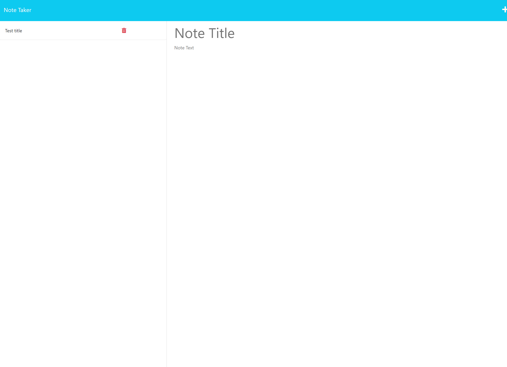

# note-taker

## Descripion

For this project the user can add notes that will be saved to the server. Then load them back up or delete them. 

## technologys

The webpage uses HTML, CSS, node and JavaScript

## learned

I learned how to make the webpage interact with a server I made

## Task

GIVEN a note-taking application
WHEN I open the Note Taker
THEN I am presented with a landing page with a link to a notes page
WHEN I click on the link to the notes page
THEN I am presented with a page with existing notes listed in the left-hand column, plus empty fields to enter a new note title and the note’s text in the right-hand column
WHEN I enter a new note title and the note’s text
THEN a Save icon appears in the navigation at the top of the page
WHEN I click on the Save icon
THEN the new note I have entered is saved and appears in the left-hand column with the other existing notes
WHEN I click on an existing note in the list in the left-hand column
THEN that note appears in the right-hand column
WHEN I click on the Write icon in the navigation at the top of the page
THEN I am presented with empty fields to enter a new note title and the note’s text in the right-hand column

## Struggles 

The biggest struggle that I ran into during this project was I had a typo that I spent 6+ hours trying to fix

## Usage

Press get started to get to the notes page. Next you can click the saved notes on the left side to view the note to add a note press the plus in the top right to make a new note. Enter the note you need and press the save in the top right that will appear once you enter your note.

## Webpage
https://hayessea000.github.io/coding-quiz/
